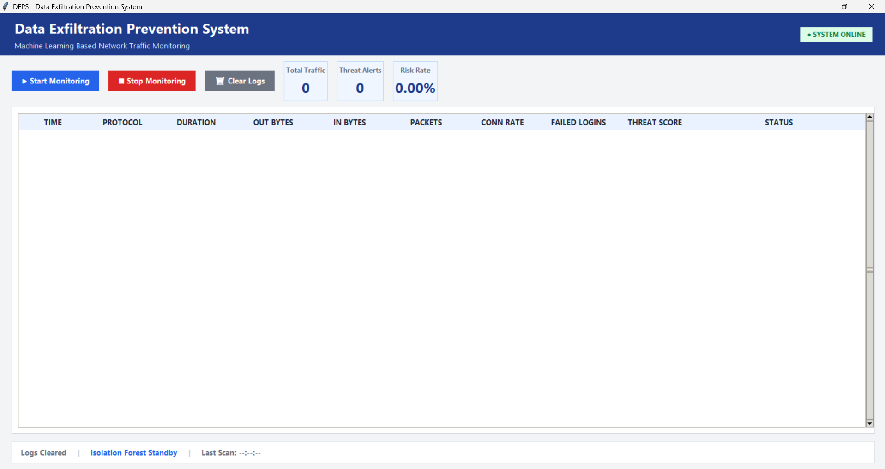
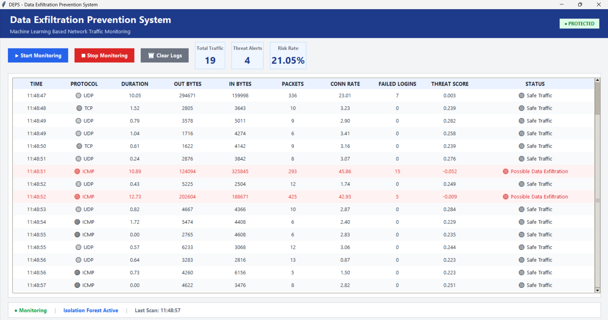

<div align="center">

# 🛡️ Data Exfiltration Prevention System

### Machine Learning Based Network Traffic Monitoring & Threat Detection


Enterprise-inspired desktop application for detecting suspicious outbound network traffic using Isolation Forest.

</div>

---

## 📸 Dashboard

### System Offline

<p align="center">

</p>

### System Monitoring

<p align="center">

</p>

---

## ✨ Features

- 🛡️ Real-Time Traffic Monitoring
- 🤖 Isolation Forest Threat Detection
- 📊 Enterprise Dashboard
- ⚠️ Live Threat Alerts
- 📈 Statistics Cards
- 🔄 Auto-Scrolling Logs
- 🕒 Timestamped Monitoring
- 🔵 TCP / 🟠 UDP / 🟣 ICMP Visualization

---

## 🛠️ Tech Stack

- Python
- Tkinter
- Scikit-Learn
- Pandas
- NumPy
- Joblib

---

## 📂 Project Structure

```text
Data-Exfiltration-Prevention-System/
│
├── screenshots/
├── main.py
├── model_deps_iforest.pkl
├── deps_sample_traffic.csv
├── requirements.txt
└── README.md
```

---

## 🚀 Run

```bash
git clone https://github.com/Nravitejareddy/Data-Exfiltration-Prevention-System.git

cd Data-Exfiltration-Prevention-System

pip install -r requirements.txt

python main.py
```

---

## 👨‍💻 Author

**Ravi Teja Reddy N**

⭐ Star this repository if you found it useful.
